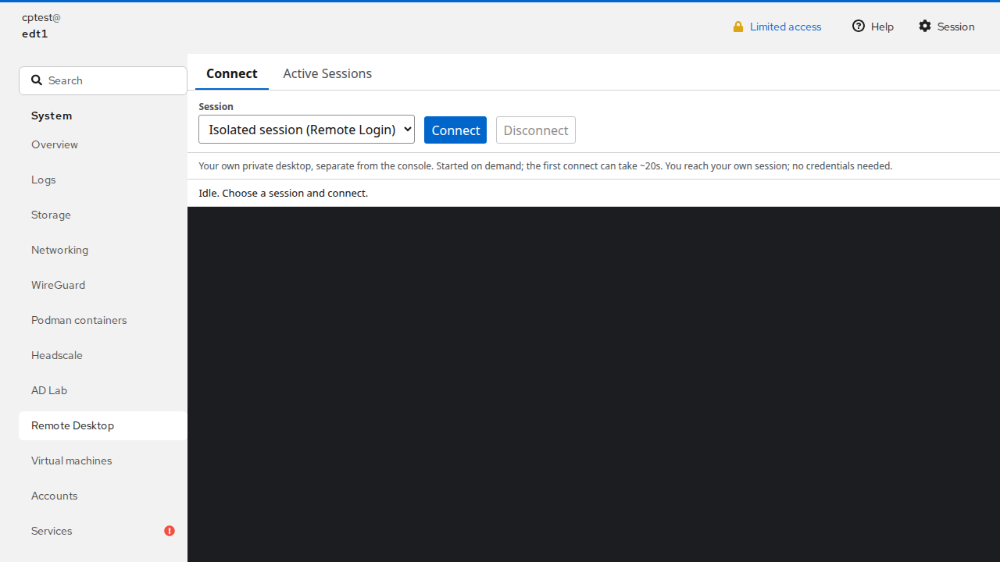
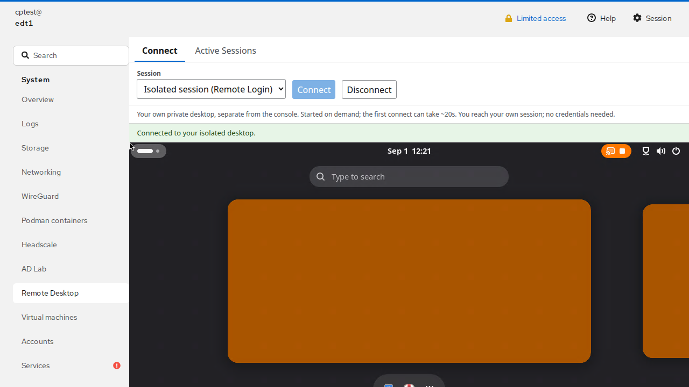
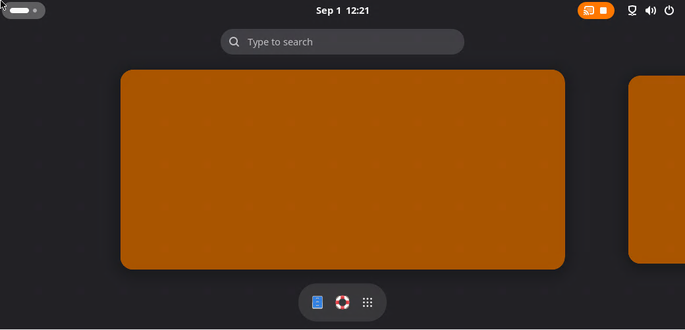
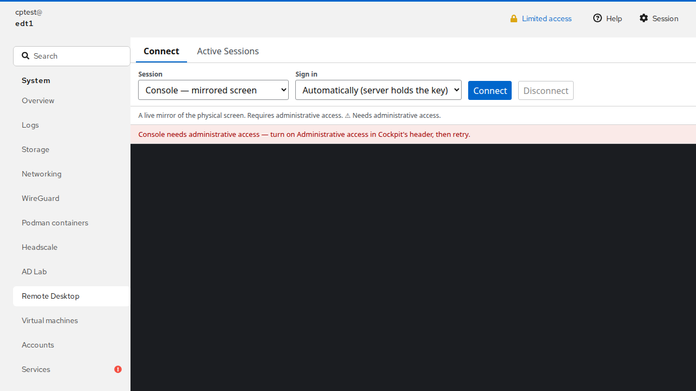

# Scenarios (with screenshots)

The plugin exposes three connection scenarios plus a session-tracking view. The images
below are captured from the live system by `cockpit-e2e/tests/doc-shots.spec.js`, running
as the **non-admin** throwaway user `cptest` — so the isolated desktop shown is a fresh,
empty session with no private content.

## The plugin page

The "Remote Desktop" page under Cockpit's *System* menu. A **Connect** tab (session
picker + Connect/Disconnect) and an **Active Sessions** tab (the live session table).
Everything rides Cockpit's own HTTPS session; no port is exposed.

## Isolated desktop (your own private session)

Your own headless GNOME desktop, separate from the physical console — *"Started on demand;
you reach your own session; no credentials needed."* It is a real, persistent desktop:
disconnect and reconnect within 15 minutes and you land back on the **same** desktop
(identified by a stable `DESKTOP_ID` UUID). The first connect takes ~20 s to spin up the
session; reconnects are immediate.

Just the rendered display (a fresh GNOME Activities overview):

## Console (mirror of the physical screen) — admin only

The **console** scenario mirrors the physical display and is gated to Cockpit
administrators. A non-admin gets *"Console needs administrative access."* The gate is
enforced **server-side** by an elevation-proven session token (reading a root-only
challenge over a superuser Cockpit channel), not by a client-side check — so it cannot be
bypassed by driving the tunnel directly (see [KNOWN_ISSUES](KNOWN_ISSUES.md) I4). No
screenshot of a live console mirror is included here because it would show the operator's
real desktop.

## Virtual monitor

A second monitor attached to your *own* logged-in session (not the console, not a separate
login). Same rendering path as the console; requires you to be that logged-in user.

## Remote host (RDP into another machine)

Turns the plugin into a browser RDP client for **other hosts on the network** — a Windows
box, another Linux RDP server, a lab VM. Pick "Remote host", enter the target's IPv4
address, port (default 3389), and the RDP username/password **for that host**, then
connect. The FreeRDP 3 bridge dials the target and renders it in the browser exactly like
the local scenarios; the credentials you type are used only for that connection and are
never stored.

Because the target is browser-chosen, this is the one path that can reach off-box, so it is
**fail-closed and admin-gated by policy**: the relay only dials hosts an administrator has
put on the allow-list `EDY_RDP_REMOTE_ALLOW` in `[install path]/.env` (normally
`/opt/cockpit-guac-rdp/.env`; formerly `/etc/default/edy-rdp`) (empty = the feature
is off). See [ARCHITECTURE.md](ARCHITECTURE.md) and the security notes in
[KNOWN_ISSUES.md](KNOWN_ISSUES.md) for how SSRF, credential-exfiltration, and MITM are
constrained (IPv4-literal targets only, per-connection credentials, `/cert:tofu` pinning).

## Session tracking

The **Active Sessions** tab reads the relay's registry: each row is a live session with
its owner uid, scenario, and virtual-desktop identity. Inactive sessions are torn down on
disconnect (bridge + guacd connection released immediately); the backing desktop persists
for the reconnect window, then the reaper reclaims it once idle. See
[ARCHITECTURE.md](ARCHITECTURE.md) for how the pieces fit together.
